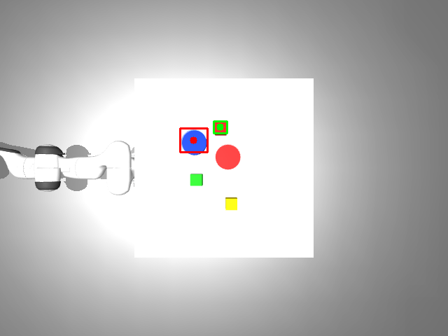
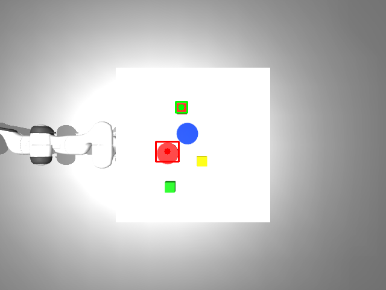
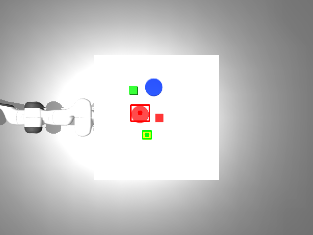
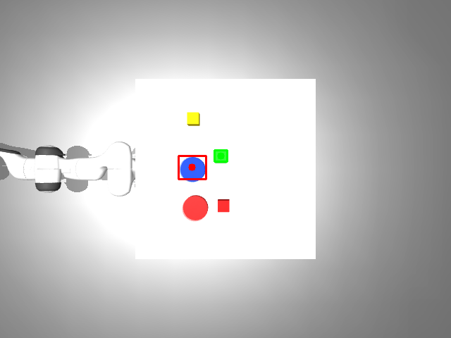

# VLA Task Pipeline
A modular Vision-Language-Action (VLA) pipeline for language-conditioned robotic pick-and-place tasks.

---

# Models Used

| Module | Model | Why |
|---|---|---|
| Prompt Parsing | **Gemini** (`gemini-2.0-flash`) | Handles natural language variations, metaphors, and paraphrases — maps any phrasing to structured `{colour, shape}` |
| Object Detection | **GroundingDINO** (`SwinT-OGC`) | Open-vocabulary detector; finds objects by text query without fine-tuning; runs fully on CPU |
| Depth → 3D | **Pinhole back-projection** | Exact closed-form math using MuJoCo's metric depth output; no neural estimation needed |

---

# Spatial Math

Given a detected pixel `(u, v)` and its metric depth `Z` from the depth map, the 3D camera-frame coordinates are:

```
X = (u - cx) * Z / fx
Y = (v - cy) * Z / fy
Z = depth[v, u]
```

where `fx, fy, cx, cy` come from the camera intrinsic matrix `K`. These camera-frame coordinates are then rotated and translated into world frame using the fixed overhead camera's extrinsic matrix.

Object height is estimated from the depth image itself — a small disk around the centroid gives the top surface depth, and a surrounding annulus gives the local support plane depth. No hardcoded object or table heights are used anywhere.

---

# Project Structure

```bash
vla_task/
├── starter_code/
│   └── sim_env.py                  # Simulation environment API
├── weights/
│   ├── groundingdino_swint_ogc.pth # GroundingDINO pretrained model weights
│   └── GroundingDINO_SwinT_OGC.py  # GroundingDINO model configuration file
├── demos/
│   ├── demo1.mp4                   # Demo 1 execution video
│   ├── demo1.png                   # Demo 1 GroundingDINO detection output
│   ├── demo2.mp4                   # Demo 2 execution video
│   ├── demo2.png                   # Demo 2 GroundingDINO detection output
│   ├── demo3.mp4                   # Demo 3 execution video
│   ├── demo3.png                   # Demo 3 GroundingDINO detection output
│   ├── demo4.mp4                   # Demo 4 execution video
│   └── demo4.png                   # Demo 4 GroundingDINO detection output
├── output/                         # Auto-created: debug detection images saved here
├── perception.py                   # Vision-language grounding and object detection
├── projection.py                   # 2D pixel to 3D world coordinate conversion
├── robot_control.py                # Robot motion and gripper control
├── pipeline.py                     # Main pipeline entry point
├── SOLUTION.md                     # Solution explanation
├── README.md
└── requirements.txt
```

---

# Code Overview

### `sim_env.py`
Sets up the MuJoCo simulation world, table, robot arm, and all objects (red/green/yellow cubes, blue/red bowls).
Handles physics stepping, camera rendering, IK-based motion, and gripper control via PD controllers.

### `perception.py`
Uses Gemini to parse natural language prompts into structured object descriptions (colour + shape), then feeds those into GroundingDINO to detect and localise each object in the camera image.
Returns pixel centroids and bounding boxes for both the target object and the destination.

### `projection.py`
Back-projects 2D pixel detections into 3D world coordinates using the overhead depth image and camera intrinsics/extrinsics.
Estimates each object's top surface height and local support plane from the depth map — no hardcoded heights used.

### `robot_control.py`
Executes the full pick-and-place motion sequence: open gripper → pre-grasp → descend → grasp → lift → transit → drop → release → home.
All Z heights are computed from depth-derived geometry passed in from `projection.py`.

### `pipeline.py`
The main entry point that wires all modules together: parse prompt → move to photo pose → detect objects → project to 3D → execute pick-and-place.
Supports single prompt, interactive loop, demo mode, and optional video recording.

---

# Setup Instructions

## 1. Create a Virtual Environment

Install Python venv support:
```bash
sudo apt update
sudo apt install python3.10-venv
```

Create the virtual environment:
```bash
python3 -m venv venv
```

---

## 2. Activate the Virtual Environment
```bash
source venv/bin/activate
```

---

## 3. Install Dependencies
```bash
pip install -r requirements.txt
```

---

## 4. Set Up Gemini API Key

The pipeline uses Gemini to parse natural language prompts. You need a free API key from Google AI Studio.

**Get your key:**
1. Go to [https://aistudio.google.com/app/apikey](https://aistudio.google.com/app/apikey)
2. Click **Create API Key**
3. Copy the key

**Option A — Add permanently to `.bashrc` (recommended):**
```bash
echo 'export GEMINI_API_KEY="your_api_key_here"' >> ~/.bashrc
source ~/.bashrc
```

> `source ~/.bashrc` reloads your shell config so the key is available immediately in the current terminal — without this, you would need to open a new terminal for the change to take effect.

**Option B — Set only for the current terminal session:**
```bash
export GEMINI_API_KEY="your_api_key_here"
```

> ⚠️ This disappears when you close the terminal. You will need to re-run it each time you open a new session.

**Verify it is set correctly:**
```bash
echo $GEMINI_API_KEY
```

> You should see your key printed. If the output is blank, the key was not set correctly — go back and repeat the step above.

---

## 5. Download GroundingDINO Weights

Create the `weights/` directory and download both files into it:

```bash
mkdir -p weights

# Download pretrained model weights (~170 MB)
wget -q https://github.com/IDEA-Research/GroundingDINO/releases/download/v0.1.0-alpha/groundingdino_swint_ogc.pth \
     -O weights/groundingdino_swint_ogc.pth

# Download model config file
wget -q https://raw.githubusercontent.com/IDEA-Research/GroundingDINO/main/groundingdino/config/GroundingDINO_SwinT_OGC.py \
     -O weights/GroundingDINO_SwinT_OGC.py
```

After downloading, your `weights/` directory should look like:
```
weights/
├── groundingdino_swint_ogc.pth   # pretrained model weights (~170 MB)
└── GroundingDINO_SwinT_OGC.py    # model config file
```

---

## 6. Run the Pipeline

```bash
python pipeline.py --prompt "Pick up the red cube and place it in the blue bowl"
```

---

# Example Prompts

The simulation scene contains **3 objects** (red cube, green cube, yellow cube) and **2 bowls** (blue bowl, red bowl). Positions are randomised at every startup.

```bash
# Direct colour + shape prompts
python pipeline.py --prompt "Pick up the red cube and place it in the blue bowl"
python pipeline.py --prompt "Pick up the green cube and place it in the red bowl"
python pipeline.py --prompt "Pick up the yellow cube and place it in the blue bowl"
python pipeline.py --prompt "Grab the red cube and drop it into the red bowl"

# Natural language variations — Gemini normalises these before DINO sees them
python pipeline.py --prompt "Move the green block into the blue container"
python pipeline.py --prompt "Take the yellow block and put it in the blood coloured bowl"
python pipeline.py --prompt "Place the red cube inside the blue bowl"
python pipeline.py --prompt "Put the grass colour cube into the apple colour bowl"
python pipeline.py --prompt "Drop the cube that is yellow into the blue bowl"
python pipeline.py --prompt "The yellow one, put it in the red bowl"
```

> **Objects in the scene:**
> - **Cubes** — red, green, yellow
> - **Bowls** — blue, red

---

---

# Output Files

| Path | What it contains |
|---|---|
| `output/debug_<timestamp>.png` | GroundingDINO detection overlay — bounding boxes and centroids drawn on the camera image. Generated after every run. |

---

# Demo Results

## Demo 1
### GroundingDINO Detection Output

### Execution Video
[▶ Watch Demo 1](demos/demo1.mp4)

---

## Demo 2
### GroundingDINO Detection Output

### Execution Video
[▶ Watch Demo 2](demos/demo2.mp4)

---

## Demo 3
### GroundingDINO Detection Output

### Execution Video
[▶ Watch Demo 3](demos/demo3.mp4)

---

## Demo 4
### GroundingDINO Detection Output

### Execution Video
[▶ Watch Demo 4](demos/demo4.mp4)